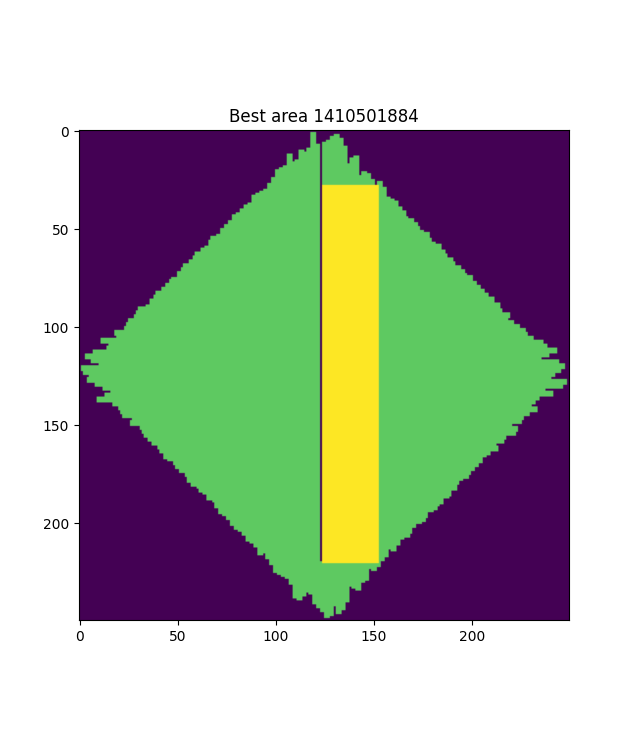

# Solving Advent of Code with python

## Progress

|       | Stars         | Date |        | Stars         | Date          |
| ----- | ------------- | ---- | ------ | ------------- | ------------- |
| **1** | :star: :star: | 2/12 | **7**  | :star: :star: | 7/12          |
| **2** | :star: :star: | 2/12 | **8**  | :star: :star: | 8/12          |
| **3** | :star: :star: | 3/12 | **9**  | :star: :star: | 9/12 (23/12)  |
| **4** | :star: :star: | 4/12 | **10** | :star:        | 10/12         |
| **5** | :star: :star: | 5/12 | **11** | :star: :star: | 11/12 (26/12) |
| **6** | :star: :star: | 6/12 | **12** | :star:        | 15/12         |

For the time being it seems I've hit a stop on december 10th and 11th. I have ideas on how to solve both but...

## December 9

Took me so many reworks, hahah. In the end I am proud of my solution. The map is reduced to a much smaller map by removing every empty row and column. This then becomes a managable size for some simple numpy compare.

The reduced area can be seen bellow, including the best rectangle. Notice the huge spike in the middle, probably killing most other good rectangles.

## Decamber 11

Just have to polish upp my graph algoithms.

## December 12

I am masively disapointed in this star :|. Before coding I made a sanity check to see how many shapes where under/equal/over the given area. I found about half where bellow. I was ready to start coding a few days later when I thought I should make sure the answer wasn't simply every area where it theoreticaly could fit... but it was.
